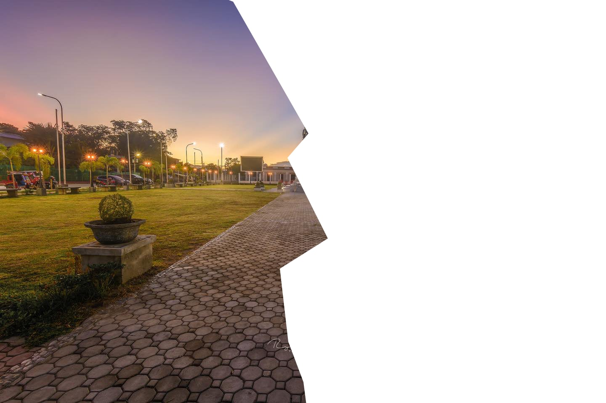
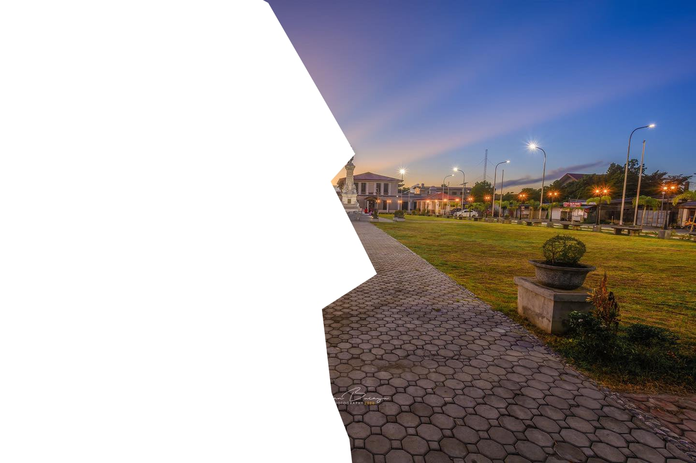

# TCON7 Writeup
## Keyboard Events

---

Category: `OSINT`
Points: `200`
Writeup by: [000rei](https://github.com/0000rei)

---

## Challenge: 

Hello Security Team,

Here is your first ticket for today, can you find something on the attachments? I left it here but someone took and hide it somewhere else nearby 


NOTE: This challenge uses a non-standard flag format. Enter the human-readable name of the location.

tcon{ location }

<button>Request_for_Assistance_in_Locating_a_Lost_Keyboard_2024-11-25T22_46_04-08_00.eml</button>

---

## Solution:

> It is a Geo OSINT challenge

Opening the attachment will reveal the email conversation of the email recipients. You can view it using a code editor such as VSCode or just Notepad.

You can see there are attachments from the `X-Attached` email headers.
```html
X-Pm-Content-Encryption: end-to-end
X-Pm-Origin: internal
Subject: Request for Assistance in Locating a Lost Keyboard
To: h3r0_HTN@proton.me <h3r0_HTN@proton.me>
From: laet4x <laet4x@protonmail.com>
Date: Tue, 26 Nov 2024 06:46:04 +0000
Mime-Version: 1.0
Content-Type: multipart/mixed;boundary=---------------------71ab6ccbb0dce920011347bcd0bac343
X-Attached: 6275742069742773207374696c6c206c6f7374.txt
X-Attached: you almost got it.txt
X-Attached: 85819ed5-5819-48f1-bac1-3ce12d8fea3f.jpeg
X-Attached: 9e44fc86-e3d0-44be-8242-4a86556a3200.jpeg
Message-Id: <Z87bBH80-5QB9EJBmpOlJn72tqctWlyysViChUwXl0CAVnZw61n53PgBwcdeksS1PbpFFm-yGsJQ_IBPJwM2_w14z3TpabQwibzK2IVBpng=@protonmail.com>
X-Pm-Scheduled-Sent-Original-Time: Tue, 26 Nov 2024 06:45:52 +0000
X-Pm-Recipient-Authentication: h3r0_HTN%40proton.me=pgp-pm
X-Pm-Recipient-Encryption: h3r0_HTN%40proton.me=pgp-pm
```

And the message is this:
> Dear Mars,
>
>  
> I hope this message finds you well. I am reaching out regarding a keyboard that I misplaced during the recent HTN Keyboard meet up. I believe it might have been left behind or misplaced at the venue.
> 
>
> To assist in identifying it, I have attached a file containing relevant details about the keyboard, including its brand and unique features.
> 
> I would greatly appreciate it if you could help check if it was found or provide any guidance on how I might recover it. Your assistance would mean a lot.
>
>
> Thank you for your time and support. Please feel to reply to this email if you need more information.
>
>
> Best regards,
> laet4x
> CEO, Zahns Pares Overload
> <a href="https://sites.google.com/view/paresxprt/home">Website URL</a>
>
> Sent with Proton Mail secure email.

Note: This is the website of the place where they gathered: https://sites.google.com/view/paresxprt/home 
The store name is "PARES EXPERTS" from the footer of the website.
```
PARES EXPERTS
Savor the Flavor, and Share the Tradition.
```

Searching the store name from the website, it is confirmed there are branches in Tuguegarao City (https://www.facebook.com/ParesMobileExpress/). 

This is the location from the FB Page:
```
Pilapil St beside RIZAL'S PARK, Tuguegarao City, Philippines
```

Checking the place in Google Maps Street View, we can connect the statue from the picture attached in the challenge and from the Street View.

At first I thought the flag would be: `tcon{Pares Experts}` or `tcon{Pares Mobile Express}`
But going back from the format, the location is Rizal Park.
So the flag is `tcon{Rizal Park}`

---
## Honorable Mentions

As I'm writing this writeup, it would be fun to use tools such as Base64 to Image converter (https://base64.guru/converter/decode/image). Unfortunately, I did not use this during the CTF.

These are the images attached in the email.


