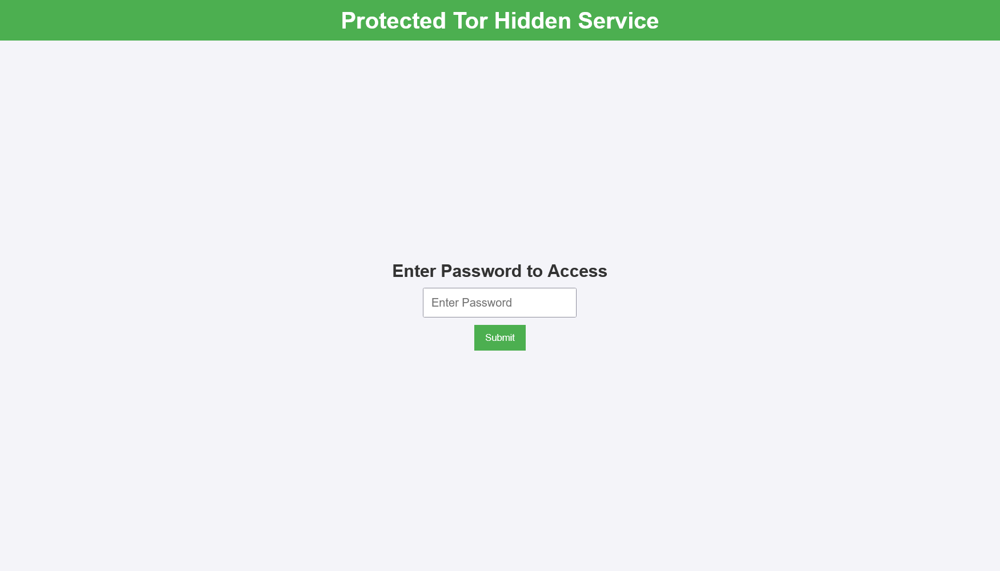
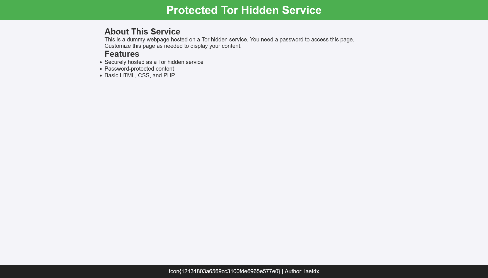

# TCON7 Writeup
## Yángcōng

---

Category: `OSINT`
Points: `500`
Writeup by: [000rei](https://github.com/0000rei)

---

## Challenge: 

Hi Thor,

laet4x hidden the flag in the darkest room way down there, he only left this unrecognized clue:

    dgfgzognat7xpv5q2jmeo7glevlkuybd7vk44o67wvobsiqi4uals4id

He said, you find the one piece out there, you need to visit his cat 'milky' at his home maybe you can find more information. 


---

## Solution:

Searching 'Yángcōng' is a chinese word for 'onion'.
Given the clue `dgfgzognat7xpv5q2jmeo7glevlkuybd7vk44o67wvobsiqi4uals4id`, it seems to be an onion site.

Onion sites, also known as Tor sites, are websites that are only accessible through the Tor network. These sites use the `.onion` domain and are part of the dark web, which is a subset of the deep web.

An onion site cannot be accessed by a regular Internet browser that we use. It can be access using a browser called [Tor Browser](https://www.torproject.org/download/). 

Open `dgfgzognat7xpv5q2jmeo7glevlkuybd7vk44o67wvobsiqi4uals4id.onion` in the Tor Browser.



It seems to be asking for a password.

The cat `milky` sure has it. By checking the exifdata of the cat picture using the commands such as `exiftool`. The password can be found in the User's comment.

```bash
$ exiftool milky.jpg
ExifTool Version Number         : 12.76
File Name                       : milky.jpg
Directory                       : .
File Size                       : 764 kB
File Modification Date/Time     : 2024:11:30 22:59:15+08:00
File Access Date/Time           : 2024:11:30 23:03:35+08:00
File Inode Change Date/Time     : 2024:11:30 22:59:15+08:00
File Permissions                : -rwxrwxrwx
File Type                       : JPEG
File Type Extension             : jpg
MIME Type                       : image/jpeg
JFIF Version                    : 1.02
X Resolution                    : 72
Y Resolution                    : 72
Exif Byte Order                 : Big-endian (Motorola, MM)
Resolution Unit                 : inches
Artist                          : laet4x
Y Cb Cr Positioning             : Centered
Exif Version                    : 0232
Components Configuration        : Y, Cb, Cr, -
User Comment                    : Password : secure123
[...]
```

Going back in the Tor site, after inputting the password, the flag can be seen:



```
tcon{12131803a6569cc3100fde6965e577e0} | Author: laet4x
```